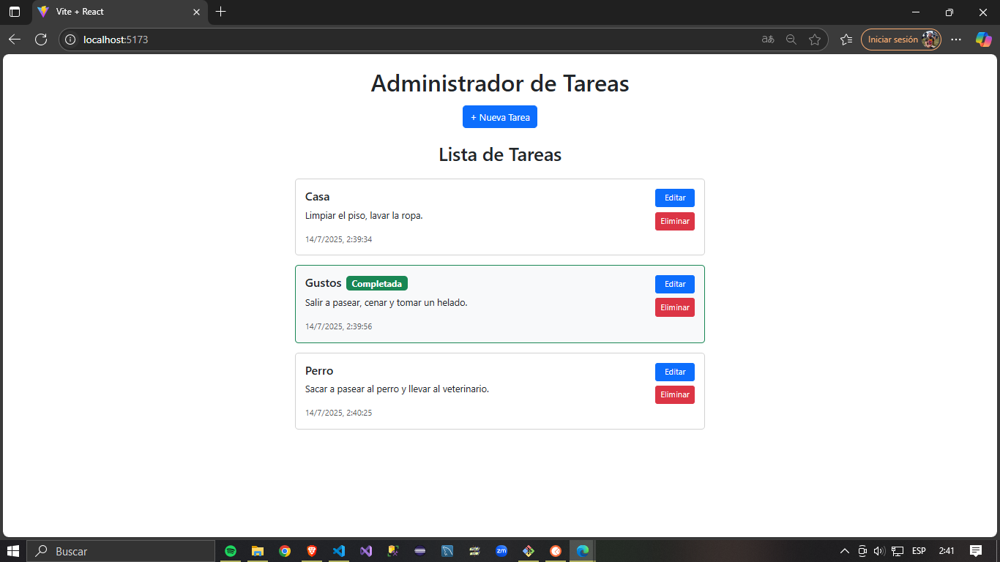
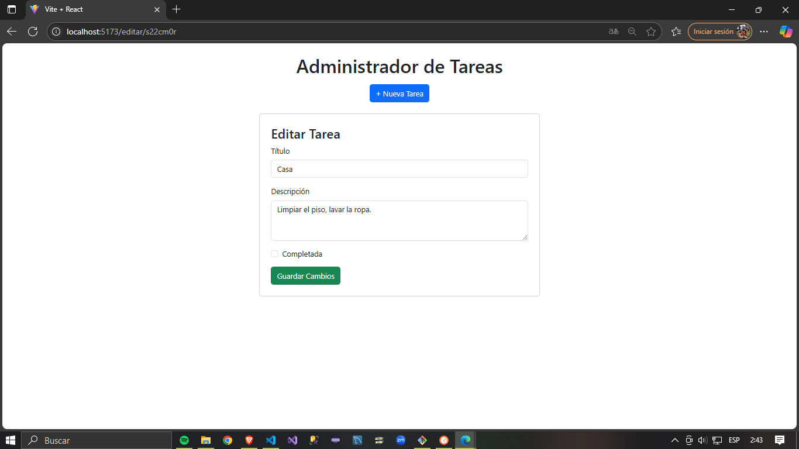

# Lista de Tareas - Proyecto Fullstack - Academia ForIT

Aplicación web desarrollada como parte del challenge técnico para demostrar conocimientos en Git, JavaScript, Node.js, Express y React.

## Funcionalidades

- Ver lista de tareas
- Crear nueva tarea
- Editar tarea existente
- Marcar tarea como completada
- Eliminar tarea
- Visualizar fecha y hora de creación

## Estructura del proyecto

/backend -> API desarrollada con Node.js y Express

/frontend -> Aplicación React desarrollada con Vite

## Cómo ejecutar el proyecto

### 1. Clonar el repositorio

git clone https://github.com/CardozoMauricioJ/forIT-academy.git
cd forIT-academy

### 2. Configurar variables de entorno

Crear los siguientes archivos:

backend/.env

PORT=3000

frontend/.env

VITE_API_URL=http://localhost:3000

### 3. Instalar dependencias

# Backend
cd backend
npm install

# Frontend
cd ../frontend
npm install

### 4. Ejecutar la aplicación

# Iniciar el backend

cd ../backend
node index.js

# En una nueva terminal, iniciar el frontend

cd ../frontend
npm run dev

Backend disponible en: http://localhost:3000

Frontend disponible en: http://localhost:5173

## Capturas de pantalla

### Pantalla principal

### Editar de tarea

### Nueva tarea

## Tecnologías utilizadas

- Frontend: React, Vite, Bootstrap

- Backend: Node.js, Express

- Control de versiones: Git y GitHub

- Linter: ESLint con configuración recomendada