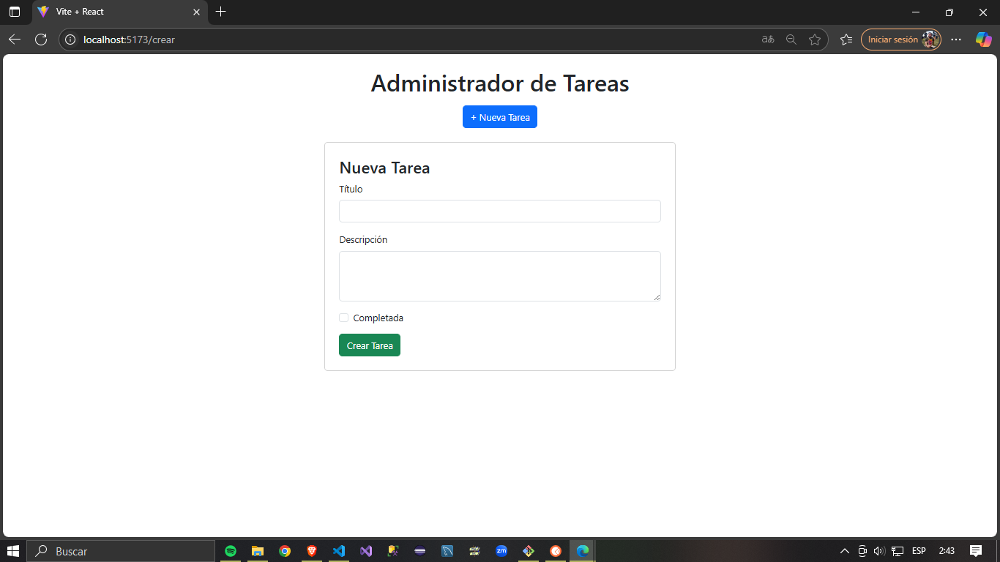

# Lista de Tareas - Proyecto Fullstack - Academia ForIT

Aplicación web desarrollada como parte del challenge técnico para demostrar conocimientos en Git, JavaScript, Node.js, Express y React.

## 🧾 Funcionalidades

- Ver lista de tareas
- Crear nueva tarea
- Editar tarea existente
- Marcar tarea como completada
- Eliminar tarea
- Visualizar fecha y hora de creación

## 🗂️ Estructura del proyecto

/backend -> API desarrollada con Node.js y Express
/frontend -> Aplicación React desarrollada con Vite

## 🚀 Cómo ejecutar el proyecto

### 1. Clonar el repositorio

```bash
git clone https://github.com/CardozoMauricioJ/forIT-academy.git
cd forIT-academy

2. Configurar variables de entorno

Crear los siguientes archivos:

📁 backend/.env

PORT=3000

📁 frontend/.env

VITE_API_URL=http://localhost:3000

3. Instalar dependencias

# Backend
cd backend
npm install

# Frontend
cd ../frontend
npm install

4. Ejecutar la aplicación

# Iniciar el backend
cd ../backend
node index.js

# En una nueva terminal, iniciar el frontend
cd ../frontend
npm run dev

Backend disponible en: http://localhost:3000

Frontend disponible en: http://localhost:5173

Capturas de pantalla

Pantalla principal


Editar de tarea


Nueva tarea


Tecnologías utilizadas

Frontend: React, Vite, Bootstrap

Backend: Node.js, Express

Control de versiones: Git y GitHub

Linter: ESLint con configuración recomendada